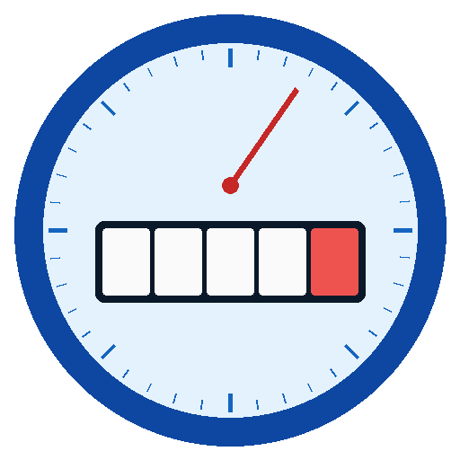

# Analog Meter Reader



A Home Assistant integration that reads the value of an **analog utility
meter** (water, gas — anything with a digit-strip/odometer display) from a
camera image, using AI vision (Google Gemini, Anthropic Claude, or any
model that speaks the OpenAI API — including self-hosted ones like Ollama,
LM Studio, or vLLM). For meters with no API or connectivity of their own,
reading the image is the only way to get them into Home Assistant at all.

The image source can be a plain snapshot URL **or any existing `camera`
entity in HA** — RTSP, ONVIF, Frigate, go2rtc, WebRTC, whatever HA already
knows how to turn into a frame. No need to know the camera's raw address or
handle its authentication separately.

Running in production since its first release, reading a real water meter
every few minutes.

## Where this came from

The same job used to be split across three separate layers: a cron job
polling the camera and querying Gemini every 10 minutes, publishing over
MQTT, and a separate Jinja template on the Home Assistant side repeating
the *same* "the meter never goes backwards" validation — with the "last
good reading" kept both in a file on disk inside the script and in an
`input_number` helper on the HA side. This integration consolidates all of
that into one place: one coordinator, one validation function (with
tests), state persisted through `homeassistant.helpers.storage.Store`
instead of a file plus a helper.

## What it provides

- **`sensor`** — the corrected meter reading (`device_class` water/gas,
  `state_class: total_increasing`), with the raw AI reading and rejection
  status in its attributes. A second, diagnostic sensor — **consecutive
  bad reads** — exposes the same counter that drives the Repair Issue
  below, visible in real time before it ever reaches the threshold.
- **`binary_sensor`** — "Suspicious reading": on when the last raw AI
  reading was rejected (the value went backwards, or jumped unrealistically)
  — a ready-made automation trigger. Its attributes carry the raw AI
  reading/response that caused it, so you can see exactly what the AI
  read. A second entity — **"Quiet hours active"** — distinguishes a
  deliberately skipped cycle (quiet hours) from plain inactivity, so a
  missing new reading doesn't look like the integration has hung.
- **`camera`** — the last frame fetched (after the optional horizontal
  flip), stamped with a timestamp in the corner — a dashboard preview
  without keeping a separate file on disk, and without guessing whether
  what you're looking at is fresh or several cycles old.
- **`number`** — three entities in the device card's "Configuration"
  section:
  - **manual override**: the value you enter immediately replaces the
    current reading and becomes the new reference point for validation.
    Useful after a run of rejected readings in a row (e.g. the AI got
    stuck on a bad value) or after the meter was physically replaced or
    reset.
  - **reading frequency** (1-1440 min) and **max realistic increase
    between readings** — the same values as in the "Configure" dialog
    (Options Flow); a change in one place shows up in the other, both
    write to the same setting and survive an HA restart.
- **`button`** — "Force reading now": fetches and reads immediately,
  without waiting for the next scheduled cycle **and regardless of quiet
  hours** (deliberately bypasses that window, unlike a normal scheduled
  cycle).
- **`text`** — quiet hours (start/end), the same value as in the Options
  Flow, just visible directly on the device card.

The integration watches its own source quality: after **6 consecutive**
rejected/uncertain readings it raises a **Repair Issue** ("possible
calibration problem") under Settings → System → Repairs — usually meaning
the camera moved or the lighting changed. It clears itself automatically
once a good reading comes back.

## How it works

Every `scan_interval_minutes` (10 min by default): fetch a frame from the
camera → optionally flip it horizontally → crop to the configured digit-strip
box and upscale ×4 → send it to the configured AI provider (Gemini/Claude/
custom API) with a prompt describing the digit layout → parse the response
→ validate it against the last accepted reading (the meter never goes
backwards; too large a jump in one cycle means either a decimal-shift
correction or rejection, keeping the previous value).

A transient error talking to the AI (timeout, dropped connection, HTTP
429/5xx) doesn't immediately wait for the next full
`scan_interval_minutes` — one extra attempt with a short backoff happens
within the same cycle. Permanent errors (bad API key, model doesn't exist)
are surfaced right away; retrying those would accomplish nothing.

## Installation

1. Copy `custom_components/analog_meter_reader` into
   `<config>/custom_components/`.
2. Restart Home Assistant.
3. Settings → Devices & Services → Add Integration → "Analog Meter Reader".
4. **Step 1:** exactly one image source — either a URL returning a single
   camera snapshot, or an existing `camera` entity in HA (pick from the
   list) — plus the AI provider (Gemini / Claude / a custom OpenAI-compatible
   API), API key, optionally an API base URL (only required for "custom
   API") and model, meter type/unit, and whether the image needs a
   horizontal flip.
5. **Step 2 — calibration with a preview:** HA's own forms can't render an
   interactive draggable box (no JS/canvas support in `config_flow`), so
   instead it shows the full image with a coordinate grid overlaid every
   50px — read the digit strip's corner pixels off it. Enter them and
   save: you'll see your box highlighted in red on the full image (to
   adjust) plus a separate preview of just the crop, enlarged ×4 (exactly
   what the AI receives, so you can check the digits are legible). Adjust
   the coordinates over a few tries until it looks right, then check
   "Confirm". A box outside the image bounds is rejected immediately with
   an error message, not silently clipped.

Nothing needs measuring in an external image editor — calibration happens
entirely in the integration's own setup form, using the grid overlaid on
the photo. To **adjust** the box later (without removing the integration
and going through `config_flow` again), use the Lovelace card described
below.

## Lovelace card for crop calibration

`config_flow` can't show an interactive rectangle (see above), but a
standalone card can. The integration registers it automatically (no
manual Lovelace resource to add) — just add the card to a dashboard:

```yaml
type: custom:analog-meter-reader-crop-card
camera_entity: camera.your_meter_last_snapshot
reading_entity: sensor.your_meter   # optional - shows the current reading
                                     # in the same card instead of adding
                                     # a separate one
```

Shows the last camera frame with a draggable box overlaid (drag the middle
to move it, a corner to resize) and a live crop preview — the same view
`config_flow` shows, just editable with a mouse or finger instead of typing
pixel coordinates. The preview scales to fit the card's width (up to ×4),
so it stays legible instead of overflowing on a narrow phone screen.
**Save box** calls the `analog_meter_reader.set_crop_box` service (the new
box applies from the next cycle, or the "Force reading now" button — no HA
restart needed, the same live-apply mechanism as the Options Flow). The
service targets the camera entity (`target: entity`, the same one as the
card's `camera_entity`) and can also be called manually from Developer
Tools.

## Options (Options Flow)

No code changes needed, via **Configure** on the integration:

- reading frequency (10 min by default)
- max realistic increase between readings (2.0 by default — adjust to
  your meter's unit and polling frequency)
- **whole-part and fractional-part digit color** (`black`/`red` by
  default — the most common layout on water/gas meters, but not the only
  one; enter an English color name, e.g. `white`, `blue` — it goes
  straight into the prompt sent to the AI)
- a custom AI prompt (empty = the default one, built automatically from
  the digit colors above — only set this if your meter's layout differs
  from "two colors, the fractional part on its own drum")
- **quiet hours** (optional, HH:MM format) — in this window the
  integration skips the cycle entirely (no image fetch, no AI call) and
  keeps the last value. Supports a window crossing midnight (e.g. 23:00 →
  06:00). Empty fields = disabled, polling continues non-stop as before.
  A real way to cut down on (paid) AI requests during hours when the
  reading is unlikely to change.
- **AI provider, API key, API base URL and model** — editable here without
  re-adding the integration (and without recalibrating the crop box).
  Providers retire models with little notice (this project has lived
  through exactly that - see the commit history) - changing the
  provider/model/key needs no code edit or redeploy, and (as of this
  version) no Home Assistant restart either.

## Icon

`custom_components/analog_meter_reader/brand/` contains `icon.png`/
`logo.png` (and `@2x` variants) — the path `hacs/action` checks first
(before falling back to [home-assistant/brands](https://github.com/home-assistant/brands)),
so HACS shows this icon right away, no separate submission to that
external repo needed. `brand/custom_integrations/analog_meter_reader/`
holds the same icon in the directory layout `home-assistant/brands` itself
requires — ready to submit there as a PR if you'd ever like the icon to
show up outside HACS too (e.g. in HA core's own integrations list). Not
submitted yet: `brands` only accepts custom-integration icons for repos
that are already public and added to the default HACS repository.

## Diagnostics

**Download diagnostics** on the integration exports the coordinator's
latest data for a bug report — the API key and camera address (which
could reveal your home network's layout) are automatically redacted.

## Known limitations

- Requires an API key from the chosen AI provider (Gemini/Claude free
  tiers have daily request limits, worth keeping in mind if polling
  often; a self-hosted "custom API" doesn't have that limit, but reading
  quality then depends on the quality of whatever model you're running).
- Reading quality depends on the camera image's sharpness/lighting and how
  well the crop box is calibrated — this isn't deterministic OCR, it's a
  language model's answer.
- The default prompt and value regex (`XXX.XXX`) assume a meter format
  with an integer and fractional part separated by a dot — a different
  format needs a custom prompt (Options Flow) and possibly a change to
  `VALUE_RE` in the code.

## Development

```bash
python3 -m venv .venv && source .venv/bin/activate
pip install pytest pytest-homeassistant-custom-component aiohttp Pillow
pytest tests/ -v
```

80 tests, covering both dependency-free pure logic (`api.py`, `image.py`,
`validation.py`, `schedule.py`, `prompt.py` — imported flat, no
Home Assistant needed) and the parts that do need a real `hass` object
(`coordinator.py`, `config_flow.py`, the `set_crop_box` service in
`__init__.py`) via `pytest-homeassistant-custom-component`.

## License

MIT — see [LICENSE](LICENSE).
